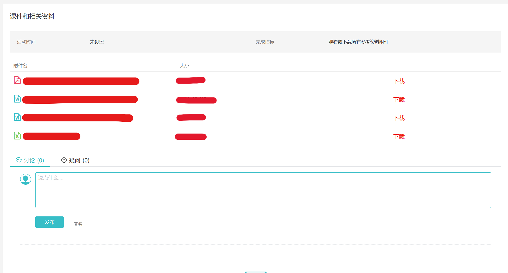

# ZJU Course Material Download

Tampermonkey 用户脚本，用于在 [学在浙大](https://courses.zju.edu.cn) 页面中添加下载按钮，获取原本无法下载的课件资源（如 PPT、PDF、视频等）。

**文件将保存为原有格式而非 PDF 文档**

新增的下载按钮将显示为红色

## 使用方法

1. 安装 [Tampermonkey 浏览器扩展](https://www.tampermonkey.net/)（iOS端可以使用 Userscript）

2. 点击下方链接安装脚本：  
    https://github.com/eWloYW8/ZJU-course-material-download/raw/refs/heads/master/zju-course-material-download.user.js

3. 打开课程页面中的学习活动

4. 等待课件加载，脚本将自动添加“下载”按钮

## 效果截图

## 注意事项

* 本脚本会对页面做出改动，可能需要开启浏览器扩展的开发者模式
* 本脚本依赖当前登录状态，需要用户已登录学在浙大
* 本脚本仅用于学习目的，**请勿用于非法传播课件内容**

